Yanpu Li, Azharuddin Priyotoo and Huan Ye produced several visuals regarding Hot car problem of New York city for passengers' perspective and MTA's perspective.

####Question 1: Which line has the most critical hot car issue during sepecific day?
They use a heatmap with weekdays as rows and Line Labels as column. The redder, the higher possibilities of taking a hot car. if color of two rectangles are similar, user can check actual possibilities in linearGradient:

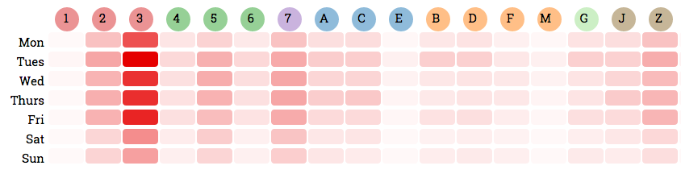 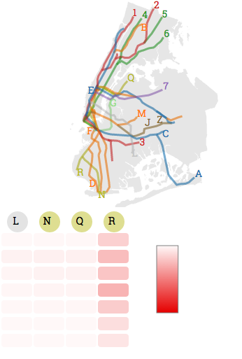

####Question 2: I want to check the frenquencies and ratios of each car type.
In parallel coordinates chart, they visualized "Hot Car" frequency count within 5 years. They calculated the ratios by using count divided by its "TotalNumber". "AvgMRatio" stands for average ratio for each car type in a certain month within 5 years. "AvgRatio" is the average AvgMRatio within all these months.
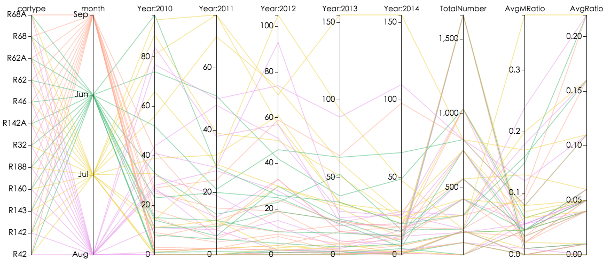

####Question 3: What is the ratio of repairing method for specific years aged cars for specific damage type?
In the sunburst chart, the inner ring represents different in-service age groups, the middle ring is the manufactuer, the outer ring shows car type.
And the parallel set shows the relationship between reasons of the hot car problems(dirty, leaking, H/W damaged, malfunctioning, others), repairing method(reset, repair, replace) and "Hot Car" frequency trend.
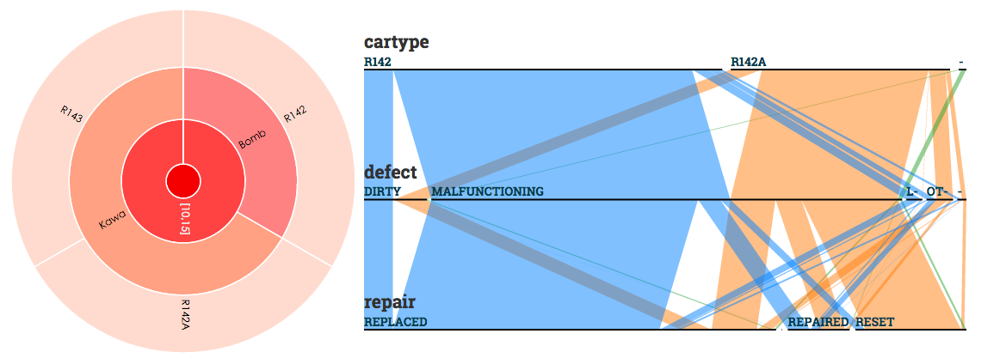
===
#####Project Link: http://hotcars-nyc.github.io/

===
#HashTags
The cool project HashTags by Cheng Deng, Mi Tian and Xing Liu visuals the information spreading through Instagram.

User can watch the growth of specific Instagram #Hashtag by clicking on the "Play" button on the right-bottom corner. And all the Instagram pictures of that Hashtag will show in the right column:

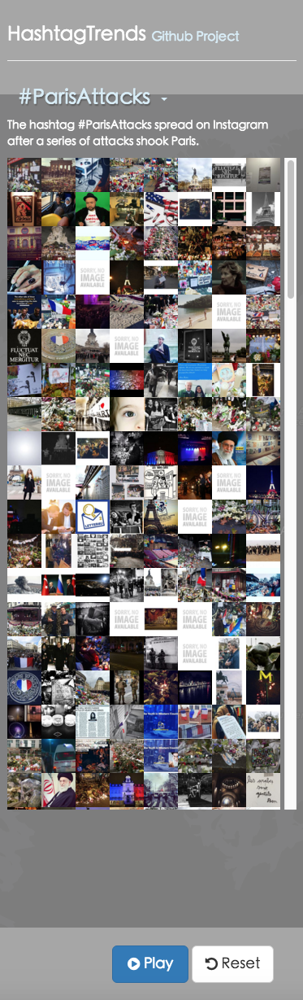

All the posts will be a red point on the zoomable map:

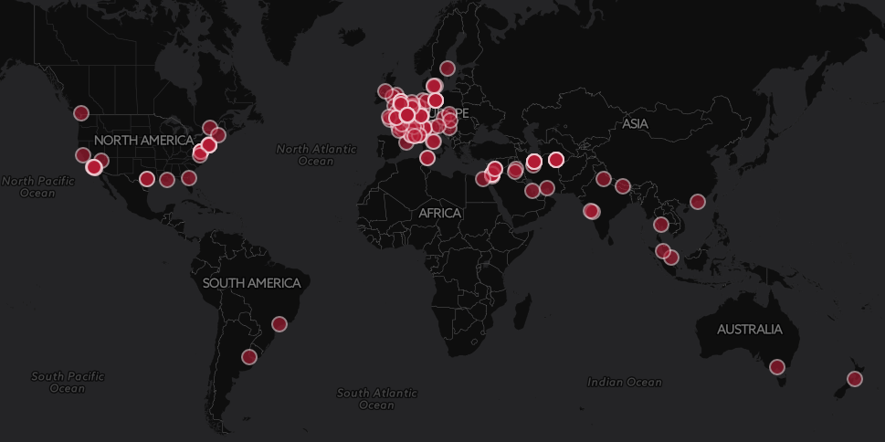

There's a time line you could check the trends of the Hashtag from:

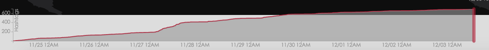

Click red points on the map can let users check on the details of that post:

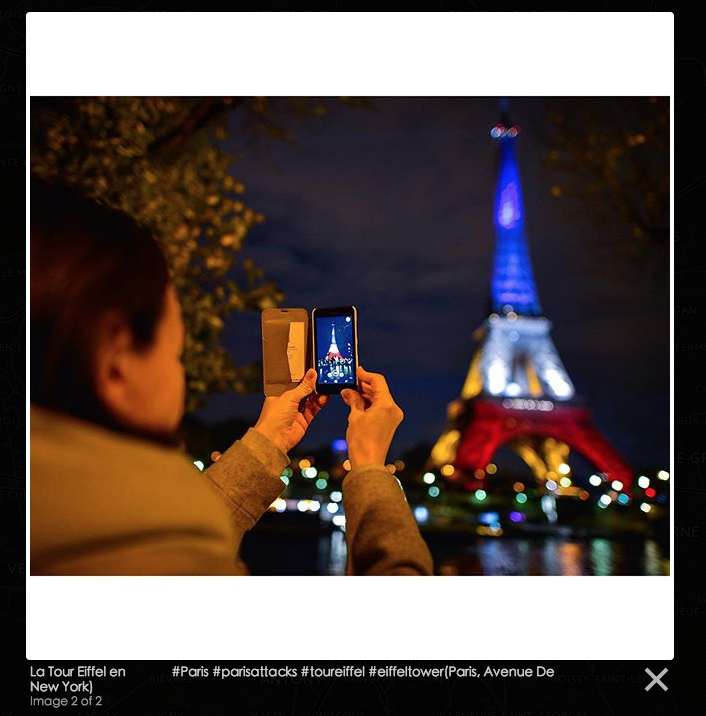

---
######Project Link: http://cdeng.github.io/HashtagTrends/

===

---
Lin Du, Zhongyuan Fu and Jifeng Kou's project DOTA2 Visualization - The Frankfurt Major 2015 focused on the competition of the most popular PC Game - DOTA2. They seperate their visual into three part: Team, Player and Hero.

They show the teams and corresponding information that participate in the Frankfurt Tournament in the “Team” page. It has a cross table of all compete, where users can clearly get the information of win/loss between teams. Users can also interact with it by click on the team dots to preview the outcomes:
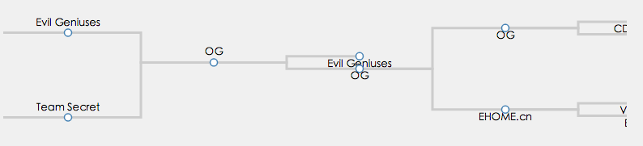

For the Player part. The scatter plot is uesd to compare different players based on different criteria. The x-axis can represent the gold earned per game for one player and the y-axis can represent the damage he made per game:
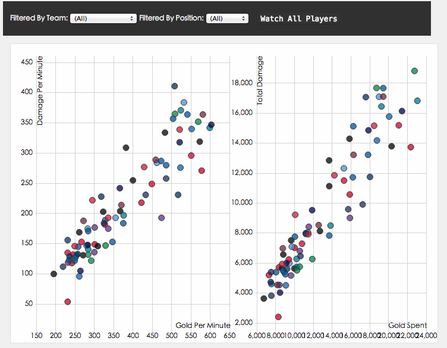

In the hero view part, they use sortable diverging stacked bar chart to show how many games a hero loses and how many games a hero wins. The order of each stacked bar can be changed by the filter, which can be sorted by the hero name, the appearance times or the win rate:
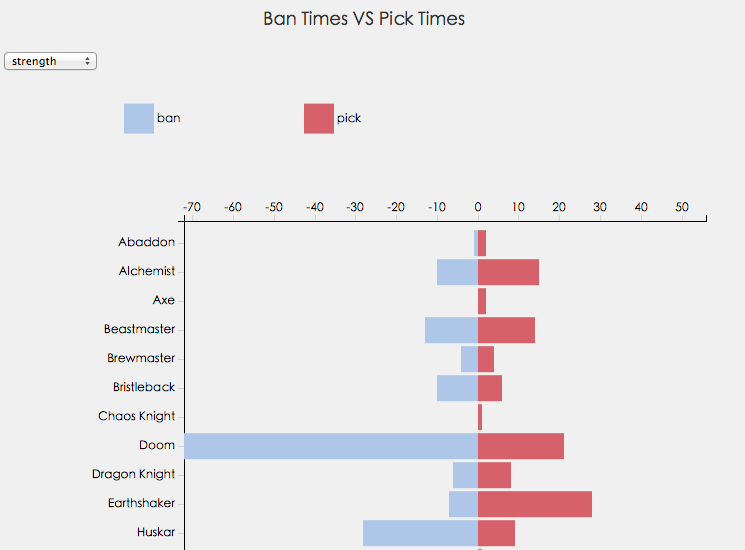

---
#####Project Link: http://datavisfordota2.github.io/vis.html
===
